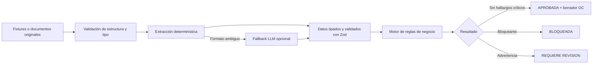

# Validador de solicitudes de compra

Aplicación web construida para una prueba técnica de automatización del proceso de compras. Recibe y revisa un expediente, contrasta sus datos con los maestros corporativos, explica cada incumplimiento y, cuando todo es válido, genera un borrador estructurado de orden de compra.

**Aplicación pública:** [reto-03-pearl.vercel.app](https://reto-03-pearl.vercel.app)

## ¿De qué se trató la prueba?

El material inicial contenía datos maestros y seis expedientes de compra con solicitudes, cotizaciones, aprobaciones por correo y, en un caso, una factura. El objetivo funcional era determinar si cada solicitud podía convertirse en una orden de compra y justificar la decisión con evidencia verificable.

La solución se desarrolló en dos etapas:

1. Un motor determinístico que interpreta los fixtures, aplica las reglas de negocio y presenta los resultados en una bandeja auditable.
2. Una entrada documental que acepta XLSX, PDF y EML originales. Primero intenta extraer los datos con código convencional y utiliza un LLM únicamente como fallback para formatos ambiguos.

El resultado no es solo una pantalla de estados: cada decisión conserva el código del control, su severidad, la explicación y el archivo o maestro que sirvió como fuente.

## Resultado funcional

La aplicación ofrece dos vistas principales:

- **Expedientes:** muestra los seis casos entregados, sus métricas y el detalle de cada validación.
- **Nueva validación:** permite cargar un paquete documental y evaluarlo sin almacenarlo.

Una evaluación puede terminar en uno de estos estados:

| Estado | Significado | Consecuencia |
| --- | --- | --- |
| `APROBADA` | No existen bloqueos ni advertencias | Se genera el borrador de la orden de compra |
| `BLOQUEADA` | Existe al menos un hallazgo bloqueante | No se genera orden hasta corregir el expediente |
| `REQUIERE_REVISION` | No hay bloqueos, pero existe una excepción | Una persona debe decidir antes de continuar |

## Flujo de procesamiento



La extracción y la decisión están deliberadamente separadas. El LLM puede ayudar a leer un documento, pero nunca aprueba compras, calcula topes ni modifica reglas.

## Lógica de negocio

El motor de dominio aplica las siguientes validaciones en orden:

### 1. Proveedor

- Busca el proveedor por NIT normalizado y, como alternativa, por nombre normalizado.
- Verifica que exista en `maestros/proveedores.json`.
- Verifica que se encuentre activo.
- Recupera su código SAP, condición de pago e indicador de IVA predeterminados.

Un proveedor inexistente o inactivo genera un hallazgo bloqueante.

### 2. Enriquecimiento de datos

Algunos campos pueden faltar en la solicitud. El sistema los completa únicamente desde fuentes confiables:

- NIT: solicitud, cotización o maestro.
- Indicador de IVA: solicitud o maestro del proveedor.
- Condición de pago: solicitud o maestro del proveedor.

Cada campo resuelto conserva su origen para que sea posible auditarlo.

### 3. Imputación contable

- El centro de costo debe existir.
- La subárea indicada debe pertenecer a ese centro.
- Los códigos de IVA y condición de pago deben estar registrados en sus maestros.

### 4. Consistencia monetaria

- `cantidad × valor unitario` debe coincidir con el total solicitado.
- Solicitud y cotización deben coincidir en cantidad, valor unitario, total, moneda y NIT cuando esté presente.
- Los importes se manejan como enteros en COP para evitar errores de punto flotante.

### 5. Aprobación

- El cuerpo del correo debe contener una aprobación explícita.
- El remitente debe aparecer como aprobador del centro de costo.
- El total cotizado no puede superar el tope autorizado para ese aprobador.

### 6. Vigencia y cronología

- La cotización debe estar vigente en la fecha de la solicitud.
- Una factura anterior a la solicitud se considera compra retroactiva y requiere revisión humana.
- Las inconsistencias cronológicas de los fixtures se conservan como observaciones informativas.

### 7. Decisión final

La precedencia es intencional:

1. Cualquier severidad `BLOQUEANTE` produce `BLOQUEADA`.
2. Sin bloqueos, una `ADVERTENCIA` produce `REQUIERE_REVISION`.
3. Sin bloqueos ni advertencias, el expediente queda `APROBADA`.

El borrador de orden solo se construye cuando la solicitud queda aprobada y todos los datos necesarios fueron resueltos.

## Ingreso y extracción de documentos

La carga admite:

| Documento | Formato | Obligatorio |
| --- | --- | --- |
| Solicitud de compra | `.xlsx` | Sí |
| Cotización | `.pdf` con texto seleccionable | Sí |
| Aprobación | `.eml` | Sí |
| Factura | `.pdf` | No |

Controles aplicados:

- máximo cuatro archivos y 4 MB por paquete;
- validación de extensión y firma binaria;
- detección de tipos documentales duplicados;
- procesamiento en memoria y sin persistencia;
- respuesta HTTP con `Cache-Control: no-store`;
- límites de tiempo, reintentos y longitud para el fallback de IA;
- instrucciones contra prompt injection y salida estructurada validada con Zod.

Los PDF escaneados sin capa de texto requieren todavía OCR o extracción multimodal.

## Arquitectura

Se aplicó una separación inspirada en Clean Architecture, manteniendo el dominio independiente de Next.js, del sistema de archivos y de OpenAI.

```text
src/
├── domain/          Modelos, esquemas, normalización, parsers y reglas puras
├── application/     Casos de uso de evaluación y extracción documental
├── infrastructure/  Lectura de fixtures y adaptadores externos
├── components/      Interfaz de usuario
└── app/             Páginas y endpoints HTTP de Next.js
```

### Dominio

`src/domain/evaluate.ts` contiene el motor principal. Es una función pura: recibe un expediente y los maestros, y devuelve una evaluación sin depender de HTTP, React, archivos o servicios externos.

### Aplicación

Coordina la carga de datos y la extracción de documentos. Decide cuándo ejecutar un parser determinístico y cuándo solicitar el fallback opcional.

### Infraestructura

Implementa los detalles externos:

- repositorio de archivos JSON y TXT;
- cliente OpenAI encapsulado detrás de un adaptador;
- lectura de PDF, Excel y correo electrónico.

### Presentación

Next.js expone la interfaz y tres recursos HTTP:

- `GET /api/solicitudes`: listado completo de evaluaciones.
- `GET /api/solicitudes/:id`: evaluación individual.
- `POST /api/ingesta`: carga y evaluación de documentos originales.

## Tecnologías utilizadas

- Next.js 16 y React 19.
- TypeScript con comprobación estricta.
- Zod para validar entradas y salidas.
- Vitest para pruebas automatizadas.
- `unpdf` para extraer texto de PDF.
- `read-excel-file` para XLSX.
- `mailparser` para EML.
- OpenAI Responses API como fallback opcional.
- Vercel para el despliegue.

## Decisiones de diseño

- **Reglas determinísticas:** una decisión financiera debe ser repetible y explicable.
- **LLM limitado a extracción:** reduce alucinaciones y evita delegar autoridad de negocio.
- **Sin base de datos:** los fixtures son de solo lectura y los documentos cargados son efímeros.
- **Trazabilidad:** todos los hallazgos señalan su fuente.
- **Esquemas en los límites:** los datos se validan antes de entrar al dominio.
- **Dinero como entero:** evita errores de precisión.
- **Dependencias invertidas:** el dominio no conoce los adaptadores externos.

## Ejecución local

### Requisitos

- Node.js 22.x.
- npm 10 o superior.

### Instalación

```bash
git clone https://github.com/AcamposPeriferia/PTecnica.git
cd PTecnica
npm ci
```

### Variables de entorno

El flujo determinístico funciona sin secretos. Para habilitar OpenAI, copie `.env.example` como `.env.local`:

```dotenv
OPENAI_API_KEY=su_clave
OPENAI_MODEL=gpt-5.5
```

`.env.local` está ignorado por Git y no debe compartirse ni versionarse.

### Inicio

```bash
npm run validate:data
npm test
npm run dev
```

Abra [http://localhost:3000](http://localhost:3000).

## Calidad y pruebas

```bash
npm run lint
npm run typecheck
npm test
npm run build
```

La suite cubre:

- integridad de los maestros y fixtures;
- parsing de cotizaciones y facturas;
- extracción de XLSX y EML;
- clasificación y firma de archivos;
- estados aprobados, bloqueados y de revisión;
- reglas de proveedor, imputación, montos, aprobación y cronología.

## Despliegue

La versión actual se ejecuta en Vercel sobre Node.js 22.x:

- Producción: [reto-03-pearl.vercel.app](https://reto-03-pearl.vercel.app)
- Repositorio: [AcamposPeriferia/PTecnica](https://github.com/AcamposPeriferia/PTecnica)

Los secretos `OPENAI_API_KEY` y `OPENAI_MODEL` están configurados únicamente en el entorno Production de Vercel. Para desplegar manualmente:

```bash
npx vercel@latest deploy --prod
```

## Limitaciones y evolución

- Incorporar OCR o entrada multimodal para documentos escaneados.
- Probar más formatos reales y documentos adversariales.
- Añadir métricas de latencia, costo y tasa de revisión manual sin registrar contenido sensible.
- Definir una política organizacional de auditoría y retención.
- Conectar GitHub con Vercel para despliegues automáticos.

El seguimiento detallado está en [`docs/ROADMAP.md`](docs/ROADMAP.md).
